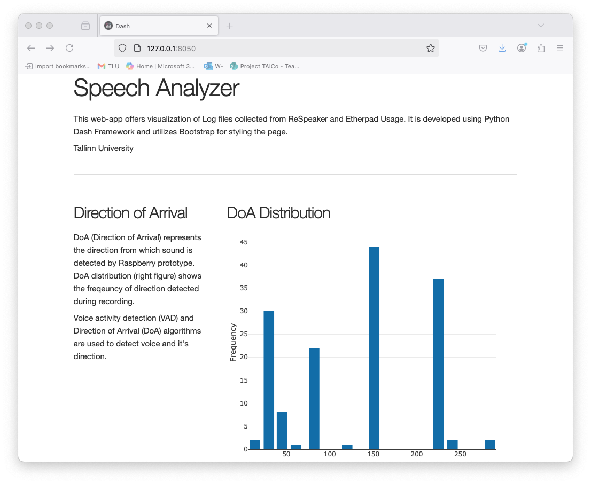

# 🎤 Speech Direction Analyzer

 
An interactive Dash application for visualizing directional speech data from ReSpeaker microphone arrays. Processes timestamped direction data to reveal speaking patterns and conversation dynamics.

## ✨ Features

- **Interactive visualizations** of speech direction over time
- **Customizable time ranges** for focused analysis

## 🛠️ Installation

### Prerequisites
- Python 3.8+
- pip package manager

### Setup
1. Clone the repository:
   ```sh
   git clone https://github.com/pankajchejara23/dash-codes.git
   cd speech-analyzer

2. Create and activate virtual environment (recommended):
    ```sh
    python -m venv venv
    source venv/bin/activate  # Linux/Mac
    ```
3. Install dependencies:
    ```sh
    pip install -r requirements.txt
    ```
## 🚀 Usage
1. Go to the `code` sub-directory
    ```sh
    cd code
    ```
2. Run the application with default demo data:
    ```sh
    python dash-speech.py ../data/demo.csv
    ```

## 📊 Data Format

The CSV file should contain:
```csv
timestamp,direction
2023-01-01 12:00:00,45.2
2023-01-01 12:00:01,312.8
...
```